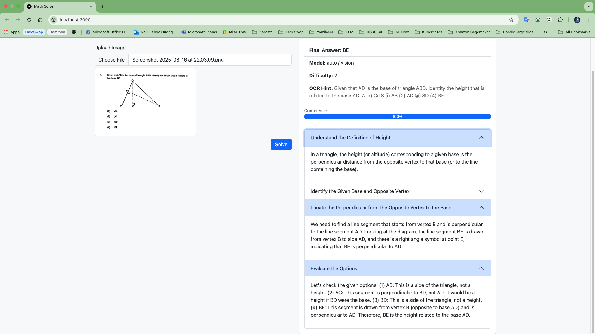
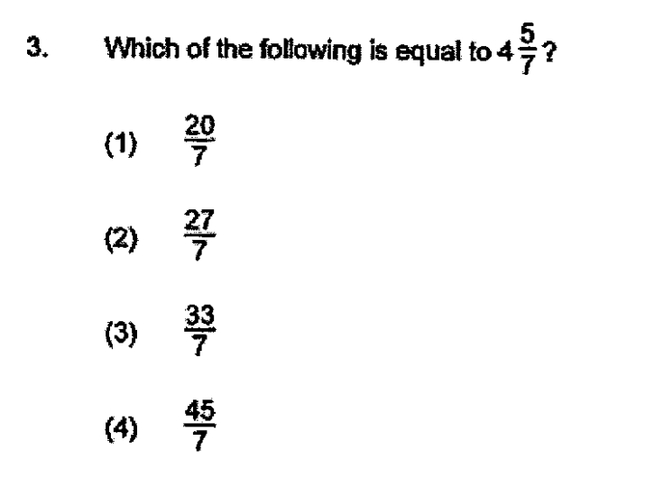
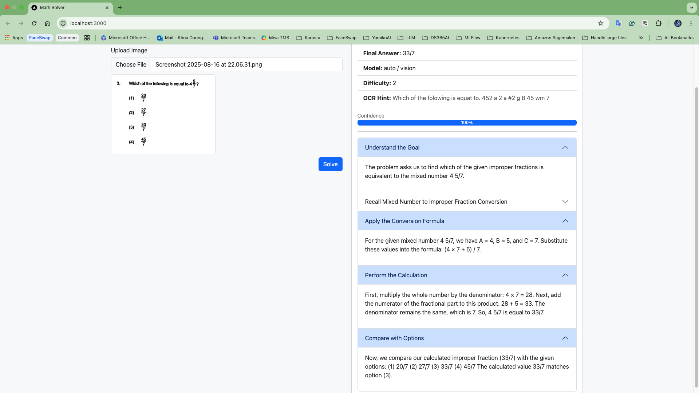
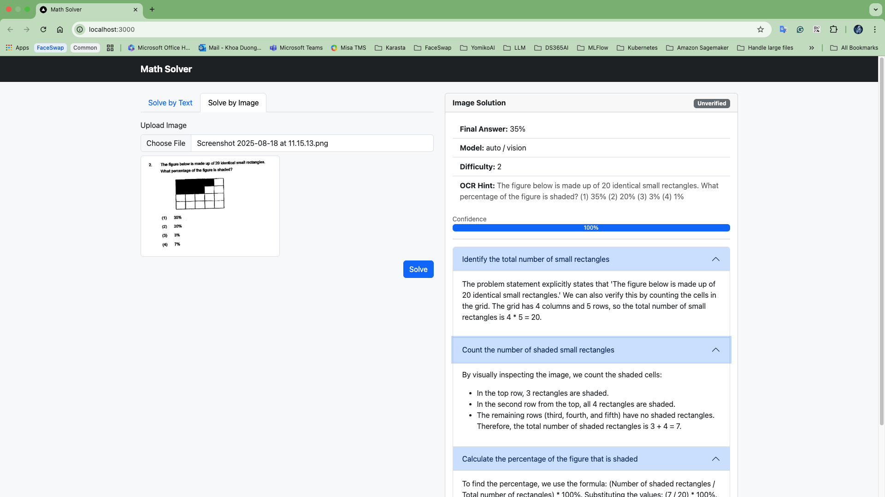
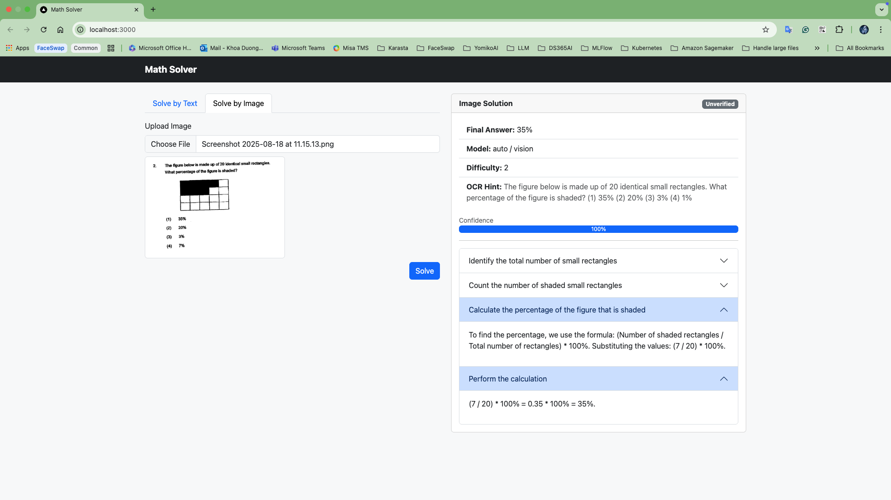
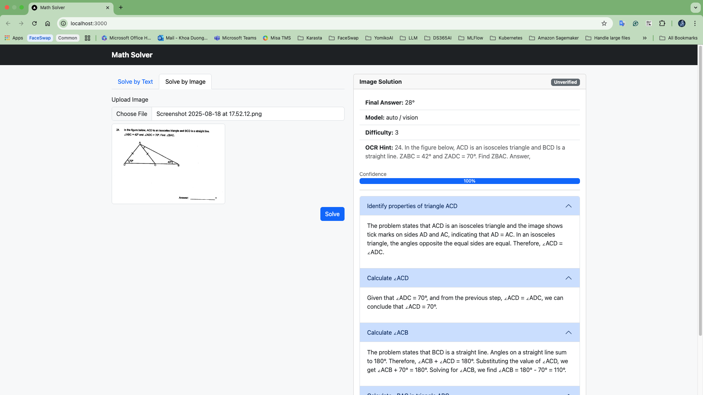
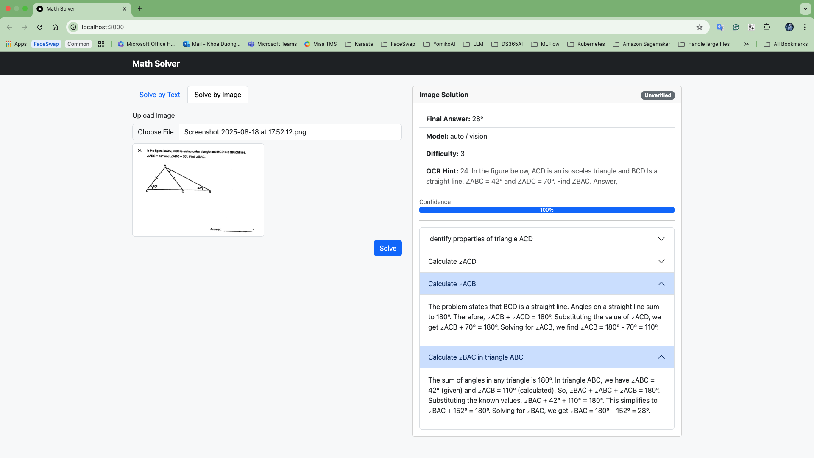

# Math Solver App

This project is a full-stack web application designed to demonstrate a modern architecture using **FastAPI** for the backend and **Next.js** for the frontend. It is containerized using Docker and orchestrated with Docker Compose so that both services can be started with a single command.

---

## ⚠️ Note on Interview Requirements

The original interview assignment requested that the frontend be implemented with **Flutter** and **Firebase**.

I would like to sincerely apologize, as I do not currently have professional experience with Flutter or Firebase. Instead, I chose to implement the frontend using **Next.js**, a framework I am proficient in. This decision was made to ensure I could deliver a working, production-grade solution within the given timeframe.

---

## Tech Stack

### Backend

* **Language:** Python 3.12
* **Framework:** [FastAPI](https://fastapi.tiangolo.com/)
* **Dependencies & Environment:** Managed with [Poetry](https://python-poetry.org/)
* **Containerization:** Docker, with slim Python base image
* **Features:**

  * RESTful API endpoints
  * Health check endpoint for service monitoring
  * Production-ready with `uvicorn` ASGI server

### Frontend

* **Language:** TypeScript / JavaScript
* **Framework:** [Next.js 15 (App Router)](https://nextjs.org/)
* **Build System:** Node.js 20 with multi-stage Docker build (dependencies → build → runner)
* **Features:**

  * Modern React components
  * API integration with the FastAPI backend
  * Production server (`next start`) listening on port **3000**
  * Health check for container orchestration

---

## Repository Navigation

The repository is organized into two main folders:

```
.
├── backend/   # FastAPI service
│   ├── Dockerfile
│   ├── pyproject.toml
│   ├── main.py
│   └── ...
│
├── frontend/  # Next.js service
│   ├── Dockerfile
│   ├── package.json
│   ├── next.config.js
│   └── ...
│
└── docker-compose.yml  # Defines and runs both services
```

### How to Run the Project

1. **Build and start both services (backend + frontend):**
- Step 1: Prepare environment files
   ```bash
   cd src/
   cp backend/.env.example backend/.env
   cp frontend/.env.example frontend/.env
   ```
   * Open `src/backend/.env` and add your `GOOGLE_API_KEY`.

- Step 2: Build and start services frontend + backend
   ```bash
   docker compose up --build
   ```

2. **Access the services:**

   * Backend API: [http://localhost:8000](http://localhost:8000)
   * Frontend App: [http://localhost:3000](http://localhost:3000)

3. **Check health endpoints:**

   * Backend health: `http://localhost:8000/health`
   * Frontend health: `http://localhost:3000`

4. **Using the Frontend (Upload Image):**

   * Open the frontend app in your browser at http://localhost:3000.
   * On the homepage, you will see an tab Solve by image.
   * Click `Choose File` to select an image from your local machine.
   * Then, click `Solve`
   * The frontend will send the image to the backend API, process it, and return the result.
   * Processed output will be displayed directly on the page.


---
### Problem Statements & Solutions

Below are the captured problems and their corresponding solutions:

#### Problem 1


**Solution:**


---

#### Problem 2


**Solution:**


---

#### Problem 3


**Solutions:**
- 
- 

---

#### Problem 4


**Solutions:**
- 
- 

---


## Conclusion

This repository demonstrates a complete full-stack project with modern frameworks, containerized deployment, and a clear separation of frontend and backend services. While it does not follow the original Flutter + Firebase requirement, the implementation showcases production-ready practices and can be easily extended or migrated.

---
